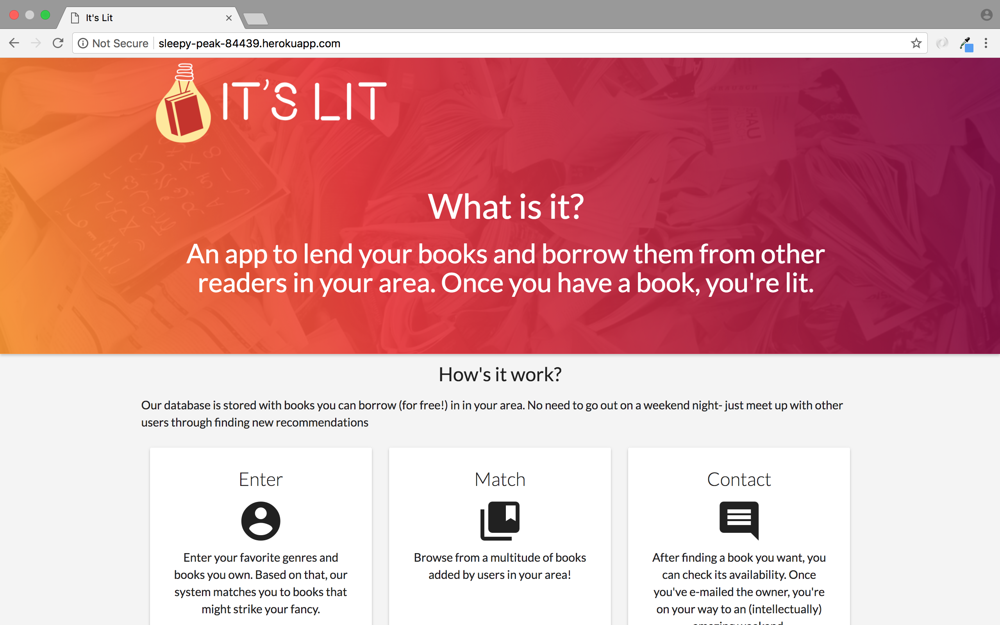
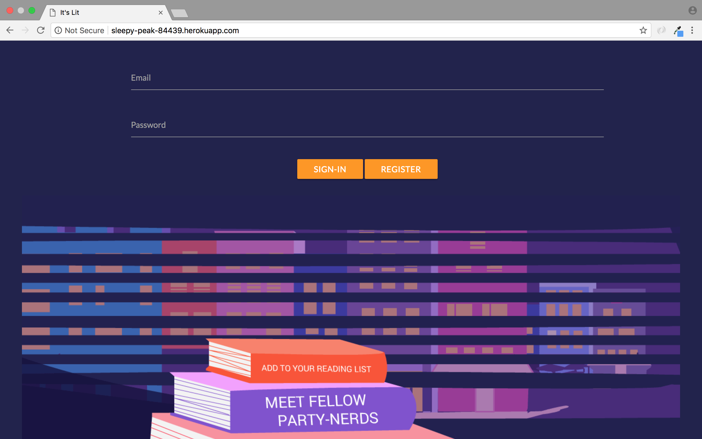
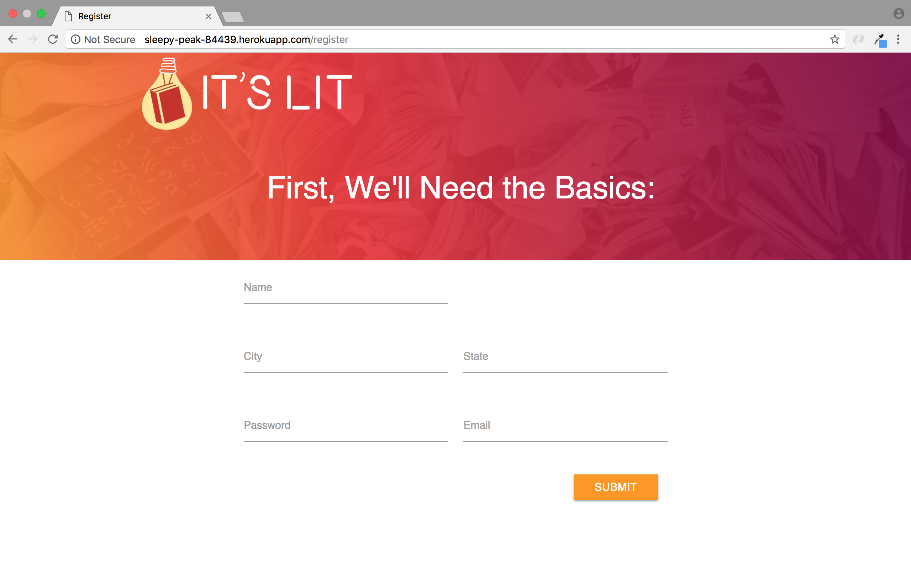
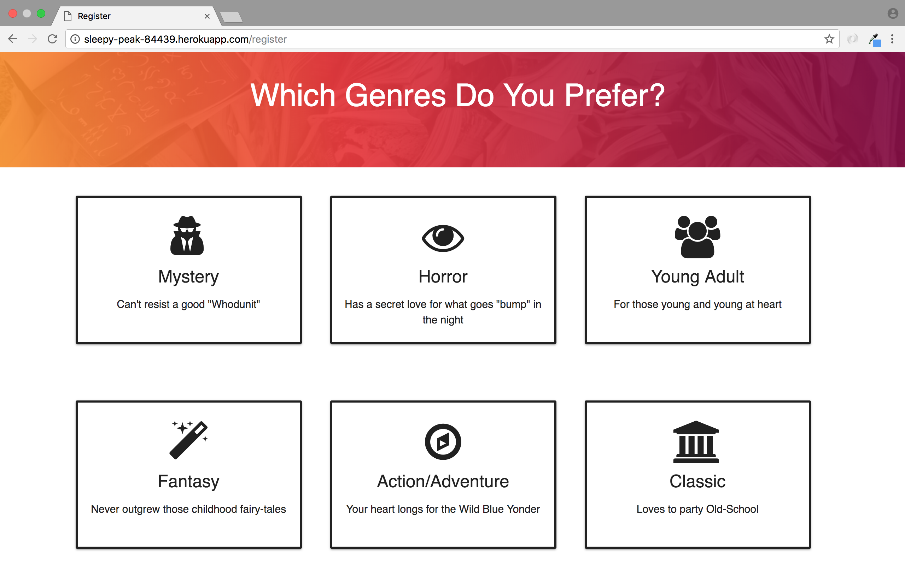
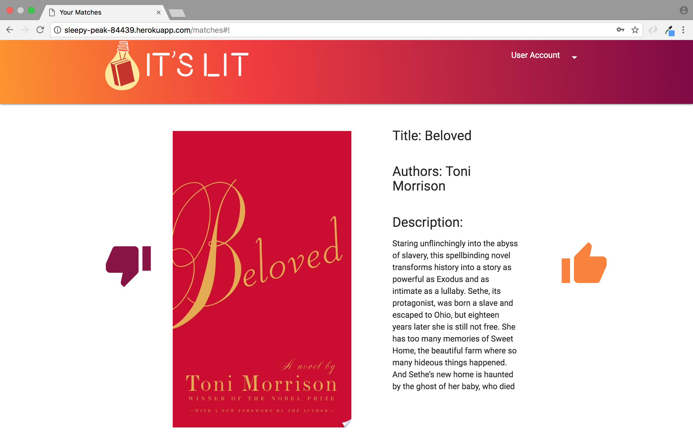
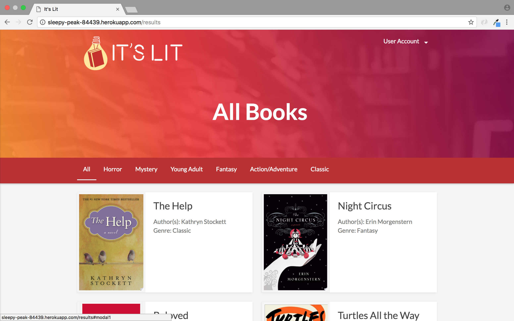
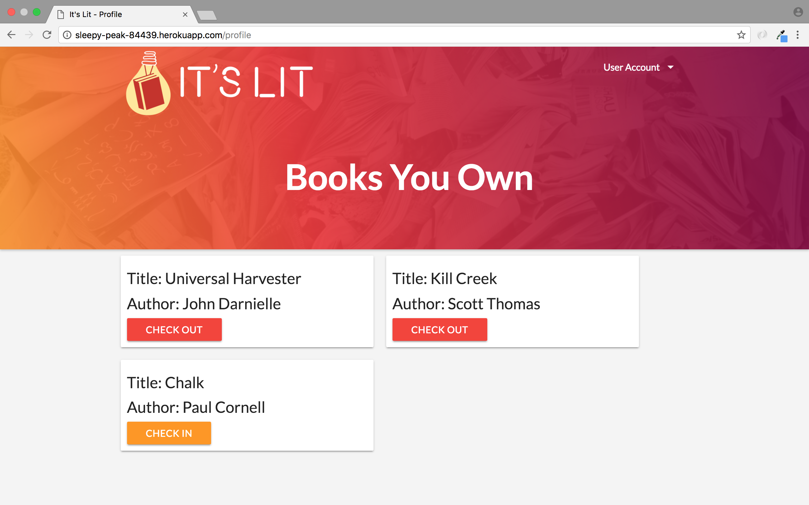

# It's Lit!
## What is it?
"It's Lit" is a user-profile centered app that enables users seeking to loan or recieve books from other users in their area. If they are seeking to browse what books to borrow in their area, the user's profile is match with books sotred in a database. In order to expand it, the user can also choose to enter books that they can't find in the database to the list for other users to find. 

## Use it!
Find the Heroku-deployed app [here](http://sleepy-peak-84439.herokuapp.com/profile).

We recommend signing up by clicking the register button for the best experience of the site, but if you're in a hurry and don't have time for that feel free to use the following login to browse the site.

#### Email: y@y.com
#### Password: y

## How it works

Users first see a brief description of the app and how to use it.

They can either sign in or register on the landing page.

If they choose to register, they will enter their basic info,

enter whatever books they're willing to lend out,

and choose which genres they're interested in.

After both registration or login, the users are led to their matches which are other people's books that are not currently lent out, based on their genre preferences.

Users can also see all of the books available on the All Books page,

or check a book they own in or out if they have lent it out to someone on the Profile page.

## Wireframing
The inital design process is relatively simple- users will be brought to a landing page that requires them to sign up for an account into order to receive content. After they enter books they may have, and the types of books they're interested in, results are shown in a gallery with a module pop-up for users to decide whether they want to "swipe right" on ones they like or "left" on ones they're not interested in.
The mock-up can be viewed here: 

https://app.moqups.com/eririzz/TQx8PmeRVQ/view 

